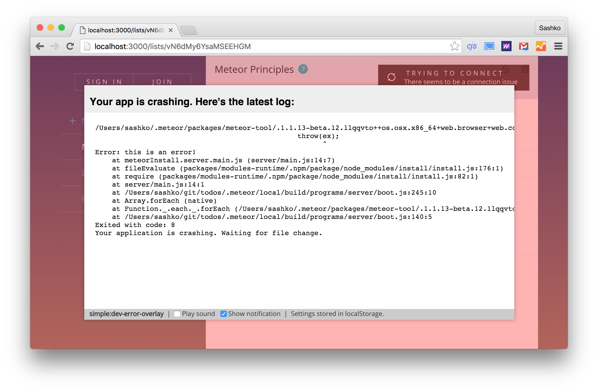

# simple:dev-error-overlay

Display a nice overlay in your browser when your Meteor app has a server-side build error. You can also optionally display a desktop notification or play a sound!

```
meteor add simple:dev-error-overlay
```

This package is `debugOnly`, meaning it won't be included in the production build of your app.



I don't plan to make significant improvements to this package. If you're passionate about it, I'd love to give you commit access so that we can improve it together!

### Future improvements to make:

* Improve Meteor command line tool to avoid rebuilding three times - because of this, this package takes very long to realize there is an error.
