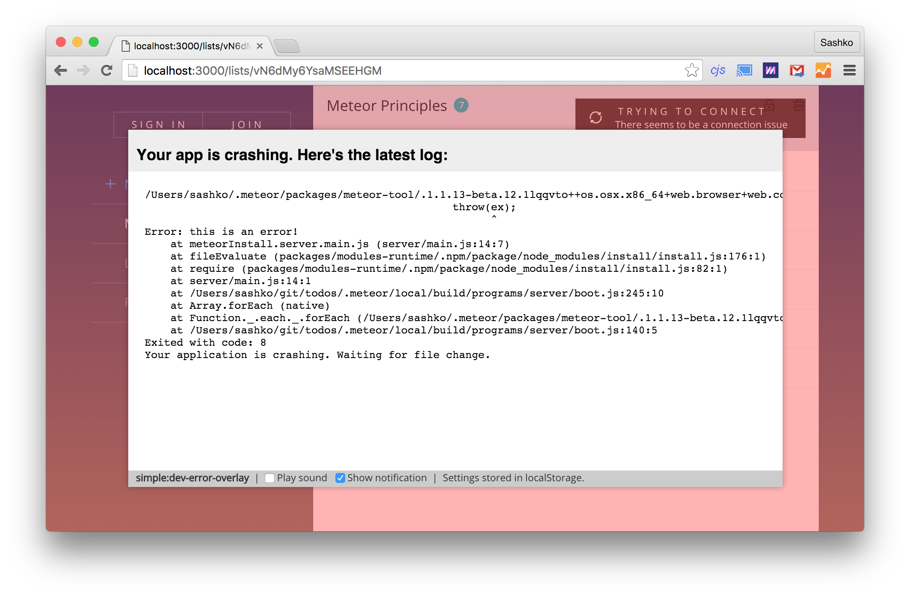

# simple:dev-error-overlay

Display a nice overlay in your browser when your Meteor app has a server-side build error. You can also optionally display a desktop notification or play a sound!

This package is `debugOnly`, meaning it won't be included in the production build of your app.

### Future improvements to make:

1. Improve Meteor command line tool to avoid rebuilding three times - because of this, this package takes very long to realize there is an error.
2. Improve sound playing functionality to not use a sketchy YouTube embed.
